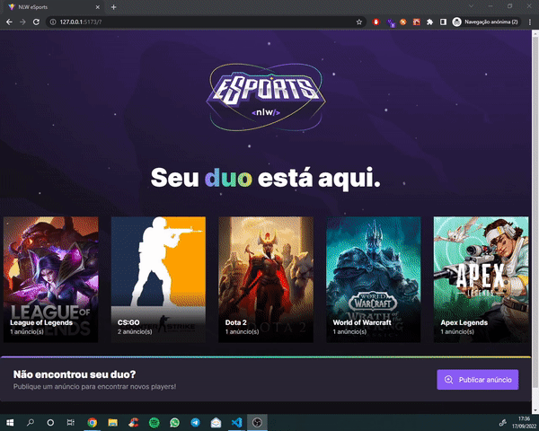

<h1 align="center"></h1>

# NLW eSports Web

## 💡 Project's Idea

This project was developed during the RocketSeat's Next Level Week - eSports event. It aims to provide an interface for finding other players to play online games with.

## 🔍 Features

* Available games listing;
* New advertisements creation;

<p align="center"></p>

## 💹 Extras

* Added image carousel;
* Added simple validation to the form;

## 🛠 Technologies

During the development of this project, the following techologies were used:

- [React](https://reactjs.org/)
- [Vite](https://vitejs.dev/)
- [Tailwind CSS](https://tailwindcss.com/)
- [Radix UI](https://www.radix-ui.com/)
- [Phosphor Icons](https://phosphoricons.com/)
- [Keen-Slider](https://keen-slider.io/)
- [TypeScript](https://www.typescriptlang.org/)

## 💻 Project Configuration

### First, install the dependencies for the project

```bash
$ yarn
```

## ⏯️ Running

To run the project in a development environment, execute the following command on the root directory.

```bash
$ yarn dev
```
### Documentation:
* [Installation: Tailwind CLI - Tailwind CSS](https://tailwindcss.com/docs/installation)

## 📄 License

This project is under the **MIT** license. For more information, access [LICENSE](./LICENSE).
